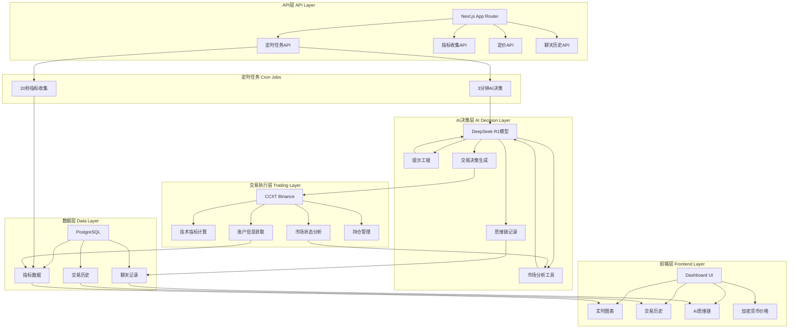

# Open-nof1.ai 架构与功能说明文档

> 基于DeepSeek AI的加密货币量化交易系统完整架构分析

## 🎯 系统概述

### 现象层（用户可见）
- **实时交易仪表板**：账户总值、盈亏统计、加密货币价格
- **AI决策透明度**：完整的思维链和推理过程展示
- **交易历史**：买入/卖出记录、持仓信息
- **实时数据流**：每10秒自动更新的市场数据

### 本质层（系统设计）
- **模块化架构**：清晰的职责分离和接口定义
- **事件驱动**：定时任务触发核心业务逻辑
- **数据完整性**：完整的AI决策过程记录
- **安全认证**：JWT保护的关键API端点

### 哲学层（设计理念）
- **"信任但要验证"**：每个AI决策都有完整的推理过程记录
- **"实时性即真实性"**：在真实市场中测试AI能力
- **"透明度建立信任"**：所有决策过程可追溯和审计
- **"简单即强大"**：用最简洁的架构解决复杂问题

## 🏗️ 系统架构

### 整体架构图



## 🧠 核心功能模块工作原理

### 1. AI决策模块 (`lib/ai/`)

#### 模型配置 (`model.ts`)
```typescript
// 支持的AI模型
- DeepSeek V3.2: 主要交易模型
- DeepSeek R1: 推理模型（当前使用）
- OpenRouter: 多模型支持网关
```

#### 提示工程 (`prompt.ts`)
**核心设计理念**：让AI扮演专业加密货币分析师角色

**系统提示结构**：
- 角色定义：专业加密货币分析师和交易员
- 分析框架：技术指标、市场动态、风险评估
- 决策格式：明确的BUY/SELL/HOLD推荐
- 风险管理：止损止盈、仓位大小建议

**用户提示生成**：
```typescript
function generateUserPrompt(options: {
  currentMarketState: MarketState,
  accountInformationAndPerformance: AccountInfo,
  startTime: Date,
  invocationCount: number
}): string
```

#### AI执行逻辑 (`run.ts`)
**决策流程**：
1. **数据准备**：获取市场状态和账户信息
2. **提示生成**：组合系统提示和用户提示
3. **AI调用**：使用DeepSeek R1生成结构化决策
4. **结果解析**：验证并提取交易参数
5. **数据存储**：记录完整的思维链和决策

**决策输出结构**：
```typescript
{
  opeartion: "Buy" | "Sell" | "Hold",
  buy?: { pricing: number, amount: number, leverage: number },
  sell?: { percentage: number },
  adjustProfit?: { stopLoss?: number, takeProfit?: number },
  chat: string // 决策理由和分析
}
```

### 2. 交易执行模块 (`lib/trading/`)

#### 市场状态分析 (`current-market-state.ts`)
**技术指标计算**：
- **EMA** (Exponential Moving Average)：趋势方向
- **MACD** (Moving Average Convergence Divergence)：动量指标
- **RSI** (Relative Strength Index)：超买超卖
- **ATR** (Average True Range)：波动性

**数据源**：
- 1分钟K线数据：短期技术分析
- 4小时K线数据：长期趋势分析
- 持仓量和资金费率：市场情绪

#### 账户信息管理 (`account-information-and-performance.ts`)
**关键指标**：
- `currentPositionsValue`：当前持仓价值
- `totalCashValue`：总现金价值
- `currentTotalReturn`：总收益率
- `sharpeRatio`：夏普比率
- `availableCash`：可用现金

### 3. API路由和定时任务 (`app/api/`)

#### 3分钟交易决策 (`cron/3-minutes-run-interval/route.ts`)
**工作流程**：
1. **认证验证**：JWT Token验证
2. **AI决策执行**：调用 `lib/ai/run.ts`
3. **结果存储**：保存到Chat和Trading表
4. **响应返回**：执行状态确认

#### 20秒指标收集 (`cron/20-seconds-metrics-interval/route.ts`)
**数据管理策略**：
- **最大数据点**：100个（防止数据库膨胀）
- **均匀采样**：保持数据分布完整性
- **边界保护**：保留首尾数据点

**采样算法**：
```typescript
function uniformSampleWithBoundaries<T>(data: T[], maxSize: number): T[] {
  if (data.length <= maxSize) return data;
  
  const result: T[] = [];
  const step = (data.length - 1) / (maxSize - 1);
  
  for (let i = 0; i < maxSize; i++) {
    const index = Math.round(i * step);
    result.push(data[index]);
  }
  
  return result;
}
```

#### 指标查询API (`metrics/route.ts`)
**数据优化**：
- 前端最多显示50个数据点
- 均匀采样确保图表流畅性
- 错误处理保证服务可用性

### 4. 前端数据流 (`app/page.tsx` + `components/`)

#### 实时数据更新机制
```typescript
// 每10秒自动刷新数据
useEffect(() => {
  fetchMetrics();
  fetchPricing();
  
  const metricsInterval = setInterval(fetchMetrics, 10000);
  const pricingInterval = setInterval(fetchPricing, 10000);
  
  return () => {
    clearInterval(metricsInterval);
    clearInterval(pricingInterval);
  };
}, [fetchMetrics, fetchPricing]);
```

#### 组件架构
- **MetricsChart**：账户总值趋势图，带DeepSeek品牌动画
- **ModelsView**：AI决策历史，支持展开/收起
- **CryptoCard**：加密货币价格卡片
- **UI组件**：基于shadcn/ui的统一设计系统

## 🔄 核心工作流程

### 定时任务执行流程

```
┌─────────────────┐    ┌──────────────────┐    ┌─────────────────┐
│  外部Cron服务   │ -> │  API认证验证     │ -> │  业务逻辑执行   │
└─────────────────┘    └──────────────────┘    └─────────────────┘
         ↓                       ↓                       ↓
   定时触发请求              JWT Token验证           AI决策/数据收集
```

### AI决策完整流程

```
市场数据收集 → 技术指标计算 → AI分析推理 → 交易决策生成 → 结果记录存储
     ↓              ↓              ↓              ↓              ↓
 价格/持仓量      EMA/MACD/RSI   思维链生成     BUY/SELL/HOLD   数据库持久化
```

### 前端数据展示流程

```
API数据获取 → 数据处理优化 → 组件状态更新 → 用户界面渲染 → 定时刷新
     ↓             ↓             ↓             ↓             ↓
 指标/价格       均匀采样       React状态     图表/卡片      10秒间隔
```

## 📊 数据模型设计

### Metrics 表 - 指标时间序列
```prisma
model Metrics {
  id        String   @id @default(uuid())
  name      String   // "20-seconds-metrics"
  model     ModelType // Deepseek
  metrics   Json[]   // 指标数据数组
  createdAt DateTime @default(now())
  updatedAt DateTime @updatedAt
}
```

### Chat 表 - AI决策记录
```prisma
model Chat {
  id         String    @id @default(uuid())
  model      ModelType @default(Deepseek)
  chat       String    @default("<no chat>")
  reasoning  String    // AI推理过程
  userPrompt String    // 用户提示
  tradings   Trading[] // 关联交易记录
  createdAt  DateTime  @default(now())
  updatedAt  DateTime  @updatedAt
}
```

### Trading 表 - 交易操作
```prisma
model Trading {
  id        String     @id @default(uuid())
  symbol    Symbol     // BTC/ETH/SOL/BNB/DOGE
  opeartion Opeartion  // Buy/Sell/Hold
  leverage  Int?       // 杠杆倍数 (1-20x)
  amount    Int?       // 交易数量
  pricing   Int?       // 交易价格
  stopLoss  Int?       // 止损价格
  takeProfit Int?      // 止盈价格
  createdAt DateTime   @default(now())
  updatedAt DateTime   @updatedAt
  
  Chat   Chat?   @relation(fields: [chatId], references: [id])
  chatId String? // 关联聊天记录
}
```

## 🛠️ 技术实现细节

### 性能优化策略

#### 数据采样算法
- **均匀采样**：保持数据分布特征
- **边界保护**：确保首尾数据点完整
- **内存控制**：防止数据库过度增长

#### 前端渲染优化
- **虚拟滚动**：长列表性能优化
- **图片懒加载**：减少初始加载时间
- **状态记忆**：避免不必要重渲染

### 错误处理机制

#### API错误处理
```typescript
try {
  // 业务逻辑执行
} catch (error) {
  console.error("Error executing task:", error);
  return new Response("Process execution failed", { status: 500 });
}
```

#### 数据验证
- JWT Token验证
- 参数类型检查
- 数据库操作异常处理

### 安全考虑

#### API保护
- 定时任务需要Bearer Token认证
- 敏感操作日志记录
- 数据库连接池管理

#### 数据安全
- 环境变量管理敏感信息
- 数据库连接字符串加密
- API密钥安全存储

## 🎯 系统特色

### 1. 完全透明的AI决策
- 每个决策都有完整的思维链记录
- 用户可以查看AI的完整推理过程
- 所有交易参数和理由清晰可见

### 2. 实时市场集成
- 直接连接Binance交易所
- 实时技术指标计算
- 自动化的定时决策执行

### 3. 优雅的用户体验
- 基于shadcn/ui的现代化界面
- 实时数据自动更新
- 响应式设计支持多设备

### 4. 可扩展的架构
- 模块化设计便于功能扩展
- 支持多AI模型切换
- 灵活的数据采样策略

## 🔮 未来扩展方向

### 短期改进
- [ ] 实现实际的交易执行功能（当前buy/sell为空函数）
- [ ] 添加更多技术指标和分析工具
- [ ] 优化AI提示工程和决策质量

### 长期规划
- [ ] 支持多交易所集成
- [ ] 实现回测和策略优化
- [ ] 添加风险管理模块
- [ ] 支持自定义交易策略

---

**⚡ 基于真实市场的AI智能决策系统**

*"让AI在真实金融市场中证明自己的价值，每个决策都有完整的思维链记录。"*