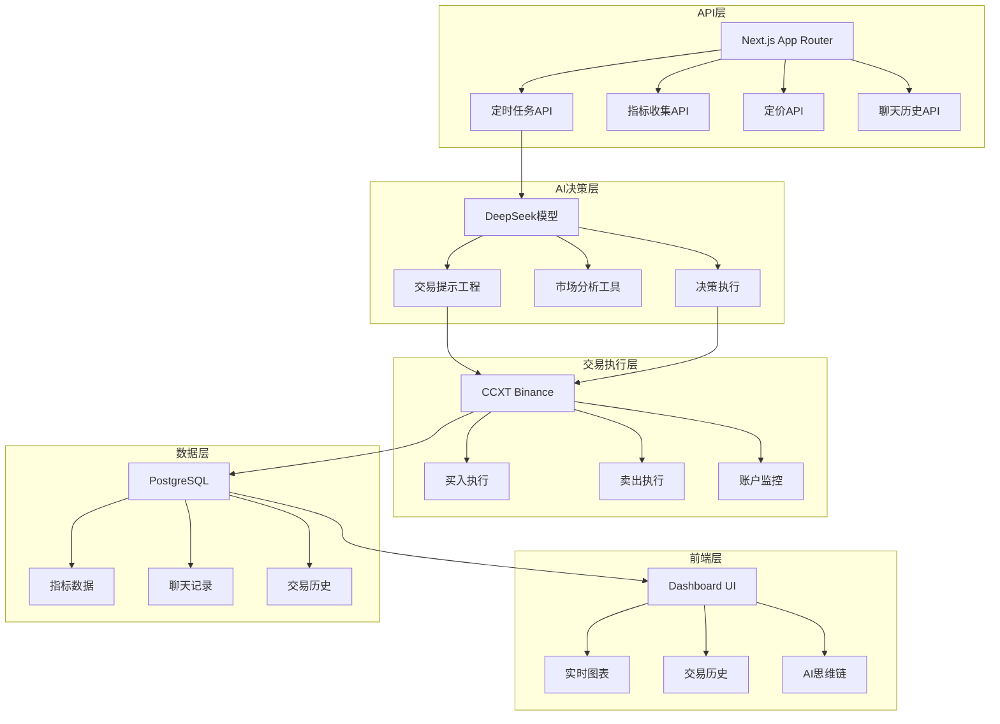

# Open-nof1.ai - AI量化交易系统

> 基于DeepSeek AI的加密货币量化交易平台，实时决策、真实资金、完全透明

## 🎯 系统愿景

构建一个**真正智能的量化交易系统**，让AI在真实金融市场中证明其决策能力。不同于传统回测，我们直接在Binance实盘交易，每个决策都有完整的思维链记录。

## 🏗️ 架构总览



## 📁 模块索引

### 🔄 定时任务模块 (`app/api/cron/`)
- `20-seconds-metrics-interval/route.ts` - 每20秒收集账户指标
- `3-minutes-run-interval/route.ts` - 每3分钟执行AI交易决策

### 📊 数据API模块 (`app/api/`)
- `metrics/route.ts` - 指标数据查询
- `pricing/route.ts` - 加密货币定价
- `model/chat/route.ts` - AI聊天历史

### 🧠 AI决策模块 (`lib/ai/`)
- `model.ts` - DeepSeek模型配置
- `prompt.ts` - 交易提示工程
- `run.ts` - AI执行逻辑
- `tool.ts` - AI工具函数

### 💹 交易执行模块 (`lib/trading/`)
- `binance.ts` - Binance交易所连接
- `buy.ts` - 买入操作
- `sell.ts` - 卖出操作
- `current-market-state.ts` - 市场状态分析
- `account-information-and-performance.ts` - 账户信息

### 🎨 UI组件模块 (`components/`)
- `ui/` - shadcn/ui基础组件
- `metrics-chart.tsx` - 指标图表
- `models-view.tsx` - 模型视图
- `crypto-card.tsx` - 加密货币卡片

### 🗄️ 数据模型 (`prisma/`)
- `schema.prisma` - 数据库架构定义

### 🔧 工具脚本 (`scripts/`)
- 测试、调试、生成工具

## 🛠️ 技术栈规范

### 前端技术
- **框架**: Next.js 15 + App Router + Turbopack
- **样式**: Tailwind CSS v4 + shadcn/ui
- **图表**: Recharts
- **状态**: React 19 Server Components

### 后端技术
- **AI**: Vercel AI SDK + DeepSeek
- **交易**: CCXT (Binance Futures)
- **数据库**: PostgreSQL + Prisma ORM
- **认证**: JWT + 定时任务密钥

### 开发工具
- **包管理**: Bun
- **类型检查**: TypeScript
- **代码规范**: ESLint
- **数据库迁移**: Prisma

## 🔄 核心工作流

### 1. 指标收集 (每20秒)
```
定时任务 → 账户信息获取 → 指标计算 → 数据库存储
```

### 2. AI决策 (每3分钟)
```
市场数据 → AI分析 → 思维链生成 → 交易决策 → 执行确认
```

### 3. 交易执行
```
AI决策 → 参数验证 → 交易所API调用 → 结果记录
```

## 🚀 快速开始

### 环境要求
- Bun 1.0+
- PostgreSQL 12+
- Binance API密钥
- DeepSeek API密钥

### 启动命令
```bash
# 开发模式
bun dev

# 构建
bun build

# 测试
bun test:cron
bun test:jwt

# 调试
bun debug:auth
```

### 数据库设置
```bash
bunx prisma generate
bunx prisma db push
```

## 📈 监控指标

- **账户总值**: 实时账户余额 + 持仓价值
- **盈亏统计**: 累计收益/损失
- **交易频率**: 买入/卖出次数
- **持仓分布**: 各资产占比
- **AI决策质量**: 思维链完整性

## 🔐 安全规范

- 所有API密钥通过环境变量管理
- 定时任务需要Bearer Token认证
- 交易操作有完整的参数验证
- 数据库连接使用连接池

## 🎯 设计哲学

> "让AI在真实市场中证明自己，每个决策都有完整的思维链记录"

- **完全透明**: 所有AI决策过程可追溯
- **实时执行**: 真实资金、真实市场
- **风险可控**: 沙盒模式测试，小资金起步
- **持续改进**: 基于真实数据优化策略

---

**⚡ 基于真实市场的AI智能决策系统**

*"市场是智能的终极测试场，让我们看看LLM是否足够聪明。"*