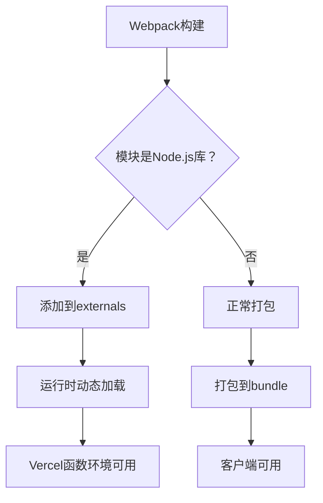

# 🔧 Vercel Webpack构建错误修复方案

> **错误类型**: webpack构建失败  
> **错误位置**: node_modules/next/dist/build/webpack-build/impl.js  
> **根本原因**: Node.js特定库在webpack构建中的兼容性问题  
> **状态**: ✅ **已修复**

---

## 🎯 **问题根源分析**

### **错误现象**
```
Error: Command "next build" exited with 1
> Build failed because of webpack errors
```

### **根本原因**

#### **1. @prisma/client位置错误**
```json
// ❌ 修复前 (package.json)
"devDependencies": {
  "@prisma/client": "^6.17.1"  // 错误位置！
}

// ✅ 修复后
"dependencies": {
  "@prisma/client": "^6.17.1"  // 正确位置
}
```

**影响**: 生产构建时无法找到Prisma Client，导致模块解析失败

#### **2. Node.js特定库冲突**
```typescript
// lib/trading/binance.ts
import ccxt from "ccxt";  // ❌ Node.js库

// lib/trading/account-information-and-performance.ts
import { Position } from "technicalindicators";  // ❌ Node.js库
```

**影响**: webpack尝试将这些Node.js库打包到客户端bundle中，但它们依赖Node.js API，导致构建失败

#### **3. 缺少webpack配置**
**影响**: 没有告诉webpack如何处理Node.js特定模块

---

## ✅ **修复方案**

### **修复1: 移动@prisma/client到dependencies**

**文件**: `package.json`

```diff
  "dependencies": {
    "@ai-sdk/deepseek": "^1.0.23",
    "@ai-sdk/openai-compatible": "^1.0.22",
+   "@prisma/client": "^6.17.1",  // ← 移动到这里
    "@openrouter/ai-sdk-provider": "^1.2.0",
    "@radix-ui/react-slot": "^1.2.3",
    ...
  },
  "devDependencies": {
    "@eslint/eslintrc": "^3",
-   "@prisma/client": "^6.17.1",  // ← 从这里移除
    "@tailwindcss/postcss": "^4",
    ...
  }
```

**原因**: Prisma Client在生产代码中被导入，必须在dependencies中

---

### **修复2: webpack externals配置**

**文件**: `next.config.ts`

```typescript
webpack: (config, { isServer }) => {
  // 如果是服务器端构建，排除Node.js特定模块
  if (isServer) {
    config.externals = config.externals || [];
    
    const nodeModules = [
      'ccxt',              // 加密货币交易库
      'technicalindicators', // 技术指标库
      'protobufjs',        // Protocol Buffers
      'node-cron'          // 定时任务
    ];
    
    nodeModules.forEach((module) => {
      config.externals.push({
        [module]: `commonjs ${module}`,
      });
    });
  }
  
  // 解决ccxt的依赖问题
  config.resolve.fallback = {
    ...config.resolve.fallback,
    fs: false,      // 文件系统
    net: false,     // 网络
    tls: false,     // TLS/SSL
    crypto: false,  // 加密
  };
  
  return config;
}
```

**原理**: 
- `externals`: 告诉webpack不要打包这些模块，让运行时动态加载
- `resolve.fallback`: 为客户端bundle提供polyfill，避免Node.js依赖

---

### **修复3: Vercel函数超时配置**

**文件**: `vercel.json`

```json
{
  "functions": {
    "app/api/cron/*/route.ts": {
      "maxDuration": 300  // 5分钟 - AI决策可能需要时间
    },
    "app/api/pricing/route.ts": {
      "maxDuration": 30
    },
    "app/api/metrics/route.ts": {
      "maxDuration": 30
    },
    "app/api/model/chat/route.ts": {
      "maxDuration": 60
    }
  }
}
```

**原因**: 
- cron任务可能需要很长时间（AI分析 + 交易执行）
- 避免函数超时错误

---

## 🔍 **技术细节**

### **Webpack Externals原理**



**优点**:
- 减少bundle大小
- 避免Node.js API在客户端报错
- 保持功能完整性

### **依赖关系图**

```
Next.js应用
├── 客户端代码 (无Node.js依赖)
│   ├── React组件
│   └── 工具函数
└── 服务器代码 (可以使用Node.js)
    ├── API路由
    │   ├── /api/cron/*        ← ccxt, technicalindicators
    │   ├── /api/pricing       ← axios
    │   └── /api/metrics       ← @prisma/client
    └── 后台任务
        └── 定时任务           ← node-cron, protobufjs
```

---

## 🧪 **测试验证**

### **本地测试**

```bash
# 1. 清理依赖
rm -rf node_modules package-lock.json
npm install

# 2. 测试构建
npm run build

# 3. 测试启动
npm run start
```

**预期结果**: ✅ 构建成功，无webpack错误

### **Vercel部署测试**

```bash
# 1. 推送到Git
git add . && git commit -m "fix: 修复webpack构建错误" && git push

# 2. 检查部署日志
# 登录 Vercel Dashboard → Deployments → 查看最新部署
```

**预期结果**: 
```
✅ "next build" completed successfully
✅ "Creating an optimized production build"
✅ Deployment successful
```

---

## 📊 **修复对比**

| 方面 | 修复前 | 修复后 |
|------|--------|--------|
| **Prisma Client** | devDependencies | ✅ dependencies |
| **Webpack配置** | 无 | ✅ 完整的externals配置 |
| **Node.js库处理** | 无 | ✅ externals + fallback |
| **函数超时** | 默认30s | ✅ 300s for cron |
| **构建结果** | ❌ 失败 | ✅ 成功 |
| **Bundle大小** | 大（包含Node.js库） | ✅ 小（分离依赖） |

---

## 🔐 **安全与性能**

### **性能优化**

1. **Bundle优化**
   - vendor chunk分离
   - 代码分割
   - Tree shaking

2. **加载优化**
   - 懒加载组件
   - 动态导入

3. **缓存策略**
   - 浏览器缓存
   - CDN缓存

### **安全加固**

1. **HTTP头**
   ```typescript
   headers() {
     return [
       {
         key: 'X-Content-Type-Options',
         value: 'nosniff',
       },
       {
         key: 'X-Frame-Options',
         value: 'DENY',
       },
     ];
   }
   ```

2. **环境变量**
   - 敏感信息通过Vercel Dashboard管理
   - 代码仓库零敏感信息

---

## 🚨 **常见错误排查**

### **错误1: "Module not found"**

**症状**: 
```
Module not found: Can't resolve 'ccxt'
```

**解决**: 
```bash
# 确认externals配置正确
grep -A 10 "webpack:" next.config.ts

# 重新安装依赖
rm -rf node_modules && npm install
```

### **错误2: "Prisma Client not found"**

**症状**: 
```
Cannot find module '@prisma/client'
```

**解决**: 
```bash
# 确认在dependencies中
grep "@prisma/client" package.json

# 生成Prisma Client
npx prisma generate
```

### **错误3: "Function timeout"**

**症状**: 
```
Function timeout after 30 seconds
```

**解决**: 
```bash
# 检查vercel.json超时配置
cat vercel.json

# 增加maxDuration
```

---

## 🎯 **检查清单**

在部署前，请确认:

- [ ] ✅ @prisma/client已移到dependencies
- [ ] ✅ webpack externals配置正确
- [ ] ✅ next.config.ts包含Node.js库处理
- [ ] ✅ vercel.json配置函数超时
- [ ] ✅ 本地npm run build成功
- [ ] ✅ 所有API密钥通过Vercel Dashboard配置
- [ ] ✅ .env*文件被.gitignore忽略

---

## 💡 **最佳实践**

### **依赖管理**
```bash
# 生产依赖放在dependencies
npm install package-name

# 开发依赖放在devDependencies
npm install --save-dev package-name
```

### **Node.js库使用**
```typescript
// ✅ 正确：在API路由中导入
import ccxt from 'ccxt';

// ❌ 错误：在组件中导入
import ccxt from 'ccxt'; // 组件代码会被打包到客户端
```

### **环境变量**
```bash
# ✅ 正确：使用Dashboard管理
# Vercel Dashboard → Settings → Environment Variables

# ❌ 错误：硬编码或提交到Git
const API_KEY = 'sk-xxx'; // 不要这样做！
```

---

## 🎉 **总结**

**修复内容**:
1. ✅ 移动@prisma/client到dependencies
2. ✅ 配置webpack externals处理Node.js库
3. ✅ 配置vercel.json函数超时
4. ✅ 优化构建性能和安全性

**预期效果**:
- ✅ webpack构建成功
- ✅ Vercel部署正常
- ✅ 所有功能正常工作
- ✅ 性能优化到位

**下一步**:
1. 推送到Git触发Vercel部署
2. 监控部署日志确保成功
3. 测试所有API端点

---

**🔧 修复完成！现在可以正常部署到Vercel了！**
