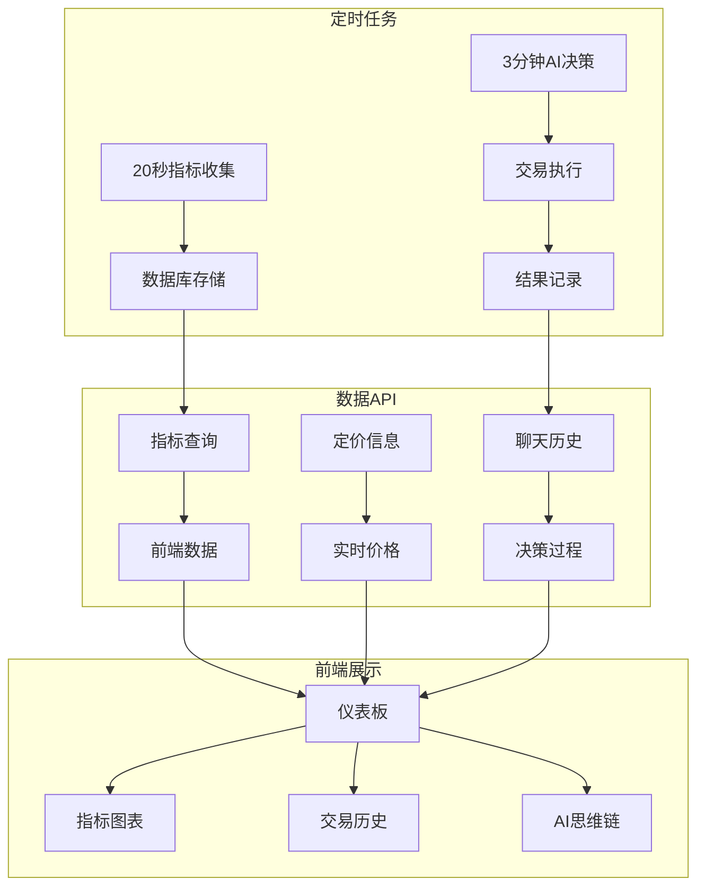

# App 模块 - Next.js 应用层

> 包含前端界面、API路由、定时任务等应用层逻辑

[🏠 返回根目录](../CLAUDE.md)

## 📁 模块结构

```
app/
├── api/                    # API路由
│   ├── cron/              # 定时任务
│   │   ├── 20-seconds-metrics-interval/
│   │   │   └── route.ts   # 20秒指标收集
│   │   └── 3-minutes-run-interval/
│   │       └── route.ts   # 3分钟交易执行
│   ├── metrics/           # 指标API
│   │   └── route.ts
│   ├── pricing/           # 定价API
│   │   └── route.ts
│   └── model/chat/        # 聊天历史API
│       └── route.ts
├── layout.tsx             # 应用布局
├── page.tsx              # 主页面
└── globals.css           # 全局样式
```

## 🔄 定时任务模块 (`api/cron/`)

### 20秒指标收集 (`20-seconds-metrics-interval/route.ts`)
- **频率**: 每20秒执行
- **功能**: 收集账户余额、持仓、盈亏等指标
- **认证**: Bearer Token验证
- **数据存储**: 写入Metrics表

### 3分钟交易执行 (`3-minutes-run-interval/route.ts`)
- **频率**: 每3分钟执行
- **功能**: AI分析市场 → 生成交易决策 → 执行交易
- **认证**: Bearer Token验证
- **数据存储**: 写入Chat和Trading表

## 📊 数据API模块 (`api/`)

### 指标查询 (`metrics/route.ts`)
- **GET**: 获取历史指标数据
- **查询参数**: 时间范围、模型类型
- **响应**: JSON格式指标数组

### 定价信息 (`pricing/route.ts`)
- **GET**: 获取加密货币实时价格
- **支持币种**: BTC, ETH, SOL, BNB, DOGE
- **数据源**: Binance API

### 聊天历史 (`model/chat/route.ts`)
- **GET**: 获取AI决策思维链
- **查询参数**: 时间范围、模型类型
- **响应**: 完整的AI推理过程

## 🎨 前端界面

### 主页面 (`page.tsx`)
- **实时仪表板**: 账户总值、盈亏统计
- **加密货币卡片**: 实时价格显示
- **交易历史**: 买入/卖出记录
- **AI思维链**: 决策过程展示

### 应用布局 (`layout.tsx`)
- **全局导航**: 页面结构定义
- **样式配置**: Tailwind CSS设置
- **元数据**: SEO优化

### 全局样式 (`globals.css`)
- **Tailwind基础样式**
- **自定义组件样式**
- **响应式设计**

## 🔄 工作流集成



## 🛠️ API接口规范

### 认证要求
所有定时任务API需要Bearer Token认证：
```typescript
Authorization: Bearer ${CRON_SECRET_KEY}
```

### 响应格式
```typescript
{
  "success": boolean,
  "data": any,
  "error": string | null
}
```

### 错误处理
- 400: 参数错误
- 401: 认证失败
- 500: 服务器错误

## 📈 性能优化

### 定时任务
- 使用轻量级处理逻辑
- 避免长时间阻塞
- 错误重试机制

### 数据查询
- 数据库索引优化
- 分页查询支持
- 缓存策略

### 前端渲染
- React Server Components
- 静态生成优化
- 图片懒加载

## 🔧 开发指南

### 添加新API路由
1. 在 `app/api/` 下创建新目录
2. 实现 `route.ts` 文件
3. 定义HTTP方法处理
4. 添加类型定义

### 调试定时任务
```bash
# 测试指标收集
curl -X POST http://localhost:3000/api/cron/20-seconds-metrics-interval \
  -H "Authorization: Bearer YOUR_SECRET"

# 测试交易执行
curl -X POST http://localhost:3000/api/cron/3-minutes-run-interval \
  -H "Authorization: Bearer YOUR_SECRET"
```

### 环境配置
```bash
# 定时任务密钥生成
bun run scripts/generate-cron-secret.js

# API测试
bun run scripts/test-cron-endpoints.js
```

## ⚠️ 注意事项

- 定时任务需要外部cron服务调用
- API认证密钥需要安全存储
- 生产环境需要HTTPS
- 数据库连接需要连接池管理

---

**🔄 实时数据 + 🧠 AI决策 + 💹 精准执行 = 📊 完整交易系统**