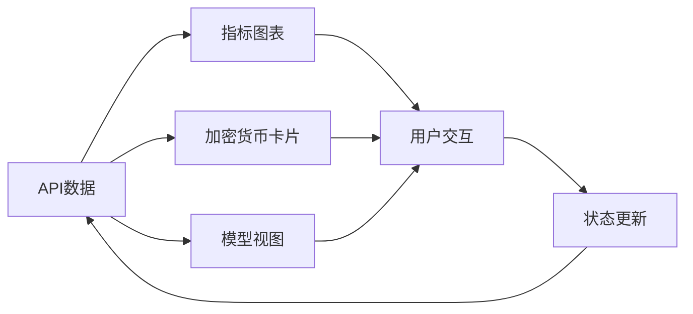

# Components 模块 - UI组件库

> 包含所有React UI组件，基于shadcn/ui构建的交易系统界面

[🏠 返回根目录](../CLAUDE.md)

## 📁 模块结构

```
components/
├── ui/                    # 基础UI组件
│   ├── button.tsx        # 按钮组件
│   ├── card.tsx         # 卡片组件
│   └── chart.tsx        # 图表组件
├── metrics-chart.tsx     # 指标图表
├── models-view.tsx       # 模型视图
├── crypto-card.tsx       # 加密货币卡片
├── animated-number.tsx   # 动画数字
└── chart.tsx            # 通用图表
```

## 🎨 基础UI组件 (`ui/`)

### 按钮组件 (`button.tsx`)
- **变体**: primary, secondary, outline, ghost
- **尺寸**: sm, md, lg
- **状态**: loading, disabled
- **用途**: 通用交互按钮

### 卡片组件 (`card.tsx`)
- **布局**: header, content, footer
- **样式**: 边框、阴影、圆角
- **用途**: 内容容器、信息展示

### 图表组件 (`chart.tsx`)
- **基础图表组件**
- Recharts集成
- 响应式设计

## 📊 业务组件

### 指标图表 (`metrics-chart.tsx`)
- **功能**: 账户总值趋势图
- **数据**: 实时指标数据
- **交互**: 悬停提示、缩放
- **样式**: 渐变线条、网格背景

### 模型视图 (`models-view.tsx`)
- **功能**: AI决策历史展示
- **内容**: 思维链、交易记录
- **布局**: 时间线、折叠面板
- **交互**: 展开/收起、搜索

### 加密货币卡片 (`crypto-card.tsx`)
- **功能**: 实时价格显示
- **币种**: BTC, ETH, SOL, BNB, DOGE
- **数据**: 价格、涨跌幅、市值
- **样式**: 渐变背景、图标

### 动画数字 (`animated-number.tsx`)
- **功能**: 数字变化动画
- **用途**: 价格、余额、盈亏显示
- **效果**: 平滑过渡、计数动画

### 通用图表 (`chart.tsx`)
- **功能**: 可配置图表组件
- **类型**: 折线图、柱状图、面积图
- **配置**: 数据源、样式、交互

## 🎯 组件设计原则

### 1. 原子设计
- **原子**: Button, Card, Input
- **分子**: CryptoCard, MetricChart
- **有机体**: ModelsView, Dashboard

### 2. 响应式设计
- 移动端优先
- 断点适配
- 弹性布局

### 3. 无障碍访问
- 语义化HTML
- 键盘导航
- 屏幕阅读器支持

## 🔄 数据流集成



## 🛠️ 开发指南

### 添加新组件
1. 定义组件接口
2. 实现组件逻辑
3. 添加样式和动画
4. 编写文档和示例

### 样式规范
```typescript
// Tailwind CSS类名
className="bg-background border rounded-lg p-4"

// 变体处理
const variants = {
  primary: "bg-primary text-primary-foreground",
  secondary: "bg-secondary text-secondary-foreground"
}
```

### 状态管理
```typescript
// 使用React状态
const [data, setData] = useState<MetricData[]>([])

// 使用SWR获取数据
const { data, error } = useSWR('/api/metrics', fetcher)
```

## 📱 组件使用示例

### 加密货币卡片
```tsx
<CryptoCard 
  symbol="BTC"
  price={45000}
  change={2.5}
  marketCap={880000000000}
/>
```

### 指标图表
```tsx
<MetricsChart 
  data={metricsData}
  timeframe="24h"
  height={300}
/>
```

### 模型视图
```tsx
<ModelsView 
  chats={chatHistory}
  trades={tradeHistory}
  onSelectChat={handleSelectChat}
/>
```

## 🎨 设计系统

### 颜色主题
- **主色**: 深蓝渐变
- **辅助色**: 绿色(盈利)、红色(亏损)
- **中性色**: 灰阶调色板

### 字体系统
- **主字体**: Inter
- **代码字体**: JetBrains Mono
- **字号**: 12px - 48px

### 间距系统
- **基础单位**: 4px
- **间距**: 4, 8, 12, 16, 20, 24, 32, 40, 48

## 🔧 性能优化

### 组件优化
- React.memo 防止不必要重渲染
- useMemo 缓存计算结果
- useCallback 缓存函数引用

### 数据优化
- 虚拟滚动长列表
- 图片懒加载
- 数据分页加载

### 动画优化
- CSS Transform 硬件加速
- requestAnimationFrame
- 减少重绘重排

---

**🎨 美观界面 + 📊 清晰数据 + ⚡ 流畅交互 = 💎 优秀用户体验**