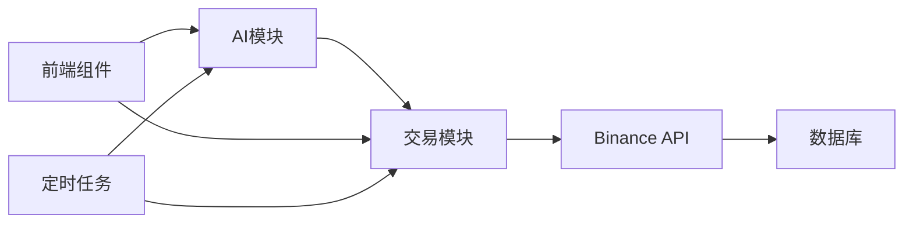

# Lib 模块 - 核心业务逻辑

> 包含AI决策、交易执行、工具函数等核心业务逻辑

[🏠 返回根目录](../CLAUDE.md)

## 📁 模块结构

```
lib/
├── ai/                    # AI决策模块
│   ├── model.ts          # 模型配置
│   ├── prompt.ts         # 提示工程
│   ├── run.ts           # AI执行逻辑
│   └── tool.ts          # AI工具函数
├── trading/              # 交易执行模块
│   ├── binance.ts       # 交易所连接
│   ├── buy.ts          # 买入操作
│   ├── sell.ts         # 卖出操作
│   ├── current-market-state.ts    # 市场分析
│   └── account-information-and-performance.ts  # 账户管理
├── types/               # 类型定义
│   └── metrics.ts      # 指标类型
├── utils.ts            # 工具函数
└── icons.tsx          # 图标组件
```

## 🧠 AI决策模块 (`ai/`)

### 模型配置 (`model.ts`)
- **DeepSeek V3.2**: 主要交易模型
- **DeepSeek R1**: 推理模型
- **OpenRouter**: 多模型支持

### 提示工程 (`prompt.ts`)
- 交易决策提示模板
- 市场分析提示
- 风险评估提示

### AI执行 (`run.ts`)
- 模型调用封装
- 思维链生成
- 决策结果解析

### 工具函数 (`tool.ts`)
- AI工具定义
- 函数调用处理
- 参数验证

## 💹 交易执行模块 (`trading/`)

### 交易所连接 (`binance.ts`)
- CCXT Binance Futures配置
- 沙盒模式支持
- API密钥管理

### 交易操作
- `buy.ts`: 买入执行逻辑
- `sell.ts`: 卖出执行逻辑
- 杠杆设置
- 止损止盈

### 市场分析
- `current-market-state.ts`: 当前市场状态
- 价格趋势分析
- 技术指标计算

### 账户管理
- `account-information-and-performance.ts`
- 余额查询
- 持仓管理
- 盈亏计算

## 🛠️ 工具模块

### 类型定义 (`types/`)
- 指标数据类型
- 交易数据类型
- AI响应类型

### 通用工具 (`utils.ts`)
- 日期处理
- 数字格式化
- 错误处理

### 图标组件 (`icons.tsx`)
- React图标组件
- 统一图标管理

## 🔄 依赖关系



## 🎯 核心接口

### AI决策接口
```typescript
// 市场分析
analyzeMarket(symbols: string[]): Promise<MarketAnalysis>

// 交易决策
makeTradingDecision(marketData: MarketData): Promise<TradingDecision>

// 思维链生成
generateReasoning(prompt: string): Promise<ReasoningChain>
```

### 交易执行接口
```typescript
// 账户信息
getAccountInfo(): Promise<AccountInfo>

// 买入操作
buy(symbol: string, amount: number, leverage?: number): Promise<TradeResult>

// 卖出操作
sell(symbol: string, amount: number): Promise<TradeResult>

// 市场状态
getCurrentMarketState(): Promise<MarketState>
```

## 📊 数据流

```
市场数据 → AI分析 → 交易决策 → 执行确认 → 结果记录
     ↓          ↓          ↓          ↓          ↓
 价格信息   思维链     买入/卖出   交易所API   数据库
```

## 🔧 开发指南

### 添加新AI模型
1. 在 `model.ts` 中添加模型配置
2. 在 `prompt.ts` 中定义专用提示
3. 在 `run.ts` 中实现调用逻辑

### 添加新交易对
1. 更新 `prisma/schema.prisma` 中的 Symbol 枚举
2. 在交易逻辑中支持新交易对
3. 更新前端显示

### 调试交易逻辑
```bash
# 测试买入逻辑
bun run scripts/manual-trigger.js

# 调试认证
bun run scripts/debug-cron-auth.js
```

## ⚠️ 注意事项

- 所有交易操作都需要完整的参数验证
- AI决策必须有完整的思维链记录
- 交易所API调用需要错误处理和重试机制
- 敏感操作需要日志记录

---

**🧠 智能决策 + 💹 精准执行 = 📈 持续盈利**