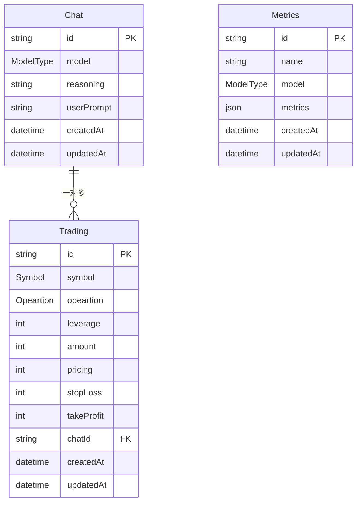

# Prisma 模块 - 数据层架构

> 数据库模型定义、数据迁移、类型生成

[🏠 返回根目录](../CLAUDE.md)

## 📁 模块结构

```
prisma/
└── schema.prisma          # 数据库架构定义
```

## 🗄️ 数据模型架构

### Metrics 表 - 指标数据
```prisma
model Metrics {
  id        String   @id @default(uuid())
  name      String   // 指标名称
  model     ModelType // 模型类型
  metrics   Json[]   // 指标数据数组
  createdAt DateTime @default(now())
  updatedAt DateTime @updatedAt
}
```

**用途**: 存储账户性能指标、市场数据等时间序列数据

### Chat 表 - AI决策记录
```prisma
model Chat {
  id         String    @id @default(uuid())
  model      ModelType @default(Deepseek) // 使用的AI模型
  chat       String    @default("<no chat>") // 聊天内容
  reasoning  String    // AI推理过程
  userPrompt String    // 用户提示
  tradings   Trading[] // 关联的交易记录
  createdAt  DateTime  @default(now())
  updatedAt  DateTime  @updatedAt
}
```

**用途**: 存储AI的完整决策过程，包括思维链和推理

### Trading 表 - 交易记录
```prisma
model Trading {
  id        String     @id @default(uuid())
  symbol    Symbol     // 交易对
  opeartion Opeartion  // 操作类型
  leverage  Int?       // 杠杆倍数
  amount    Int?       // 交易数量
  pricing   Int?       // 交易价格
  stopLoss  Int?       // 止损价格
  takeProfit Int?      // 止盈价格
  createdAt DateTime   @default(now())
  updatedAt DateTime   @updatedAt
  
  Chat   Chat?   @relation(fields: [chatId], references: [id], onDelete: Cascade)
  chatId String? // 关联的聊天记录ID
}
```

**用途**: 存储具体的交易操作记录

## 🎯 枚举定义

### 操作类型 (Opeartion)
```prisma
enum Opeartion {
  Buy    // 买入
  Sell   // 卖出
  Hold   // 持有
}
```

### 交易对 (Symbol)
```prisma
enum Symbol {
  BTC   // 比特币
  ETH   // 以太坊
  BNB   // 币安币
  SOL   // Solana
  DOGE  // 狗狗币
}
```

### 模型类型 (ModelType)
```prisma
enum ModelType {
  Deepseek         // DeepSeek聊天模型
  DeepseekThinking // DeepSeek推理模型
  Qwen            // 通义千问
  Doubao          // 豆包
}
```

## 🔄 数据关系



## 📊 数据流分析

### 写入流程
```
定时任务 → 收集数据 → 验证数据 → 写入数据库
    ↓           ↓           ↓           ↓
指标收集     账户信息     类型检查     Metrics表
AI决策      市场分析     业务逻辑     Chat表
交易执行    交易结果     参数验证     Trading表
```

### 读取流程
```
前端请求 → API路由 → 数据库查询 → 数据处理 → 返回响应
    ↓          ↓          ↓           ↓          ↓
仪表板     指标API     Metrics表    聚合计算    JSON格式
交易历史    聊天API     Chat表       关联查询    React组件
AI思维链   定价API     Trading表    排序过滤   图表数据
```

## 🛠️ 开发指南

### 数据库操作
```bash
# 生成Prisma客户端
bunx prisma generate

# 数据库迁移
bunx prisma db push

# 查看数据库状态
bunx prisma db status

# 数据种子
bunx prisma db seed
```

### 类型生成
Prisma自动生成TypeScript类型：
```typescript
import { PrismaClient } from '@prisma/client'

const prisma = new PrismaClient()

// 使用生成的类型
const metrics: Metrics = await prisma.metrics.findFirst()
const chat: Chat = await prisma.chat.findUnique({ where: { id } })
```

### 常见查询模式

#### 指标数据查询
```typescript
// 获取最近24小时指标
const metrics = await prisma.metrics.findMany({
  where: {
    createdAt: { gte: new Date(Date.now() - 24 * 60 * 60 * 1000) }
  },
  orderBy: { createdAt: 'desc' }
})
```

#### 交易历史查询
```typescript
// 获取带聊天记录的交易
const trades = await prisma.trading.findMany({
  include: {
    Chat: true
  },
  orderBy: { createdAt: 'desc' }
})
```

#### AI决策历史
```typescript
// 获取完整的AI决策过程
const decisions = await prisma.chat.findMany({
  include: {
    tradings: true
  },
  where: {
    model: 'Deepseek'
  }
})
```

## 🔧 性能优化

### 索引策略
- `createdAt` 字段索引 - 时间范围查询
- `model` 字段索引 - 模型筛选
- `symbol` 字段索引 - 交易对查询

### 数据清理
- 定期清理过期指标数据
- 归档历史交易记录
- 压缩JSON字段数据

### 查询优化
- 使用分页避免大数据量查询
- 选择性包含关联数据
- 使用原生查询处理复杂聚合

## ⚠️ 注意事项

### 数据一致性
- 交易记录必须关联有效的聊天记录
- 指标数据需要时间戳排序
- 枚举值需要前端同步更新

### 安全考虑
- 敏感数据加密存储
- SQL注入防护（Prisma自动处理）
- 数据访问权限控制

### 扩展性
- 支持新交易对需要更新Symbol枚举
- 新AI模型需要更新ModelType枚举
- 大数据量考虑分表分库

---

**🗄️ 结构化存储 + 🔄 关系映射 + 📊 时序分析 = 💾 可靠数据基础**